# What does it do?

It gets in terminal command and after 10 seconds gives result, if it is interrupted earlier its output is time in seconds when it was interrupted.

# How to use it?
in terminal type command in format 
node ./index.js {"mode" or "message"} "<path to the file in format .txt .doc or .docx> or <message you want to encrypt>"

# Examples of usage

1. file mode: 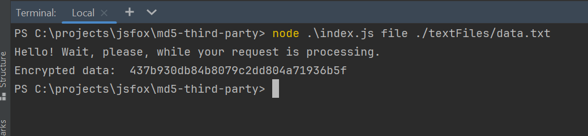
2. message mode: 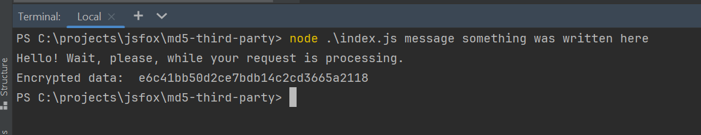
3. interruption: 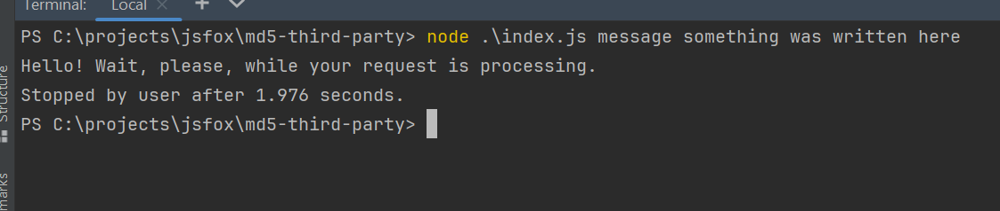
4. wrong extension: 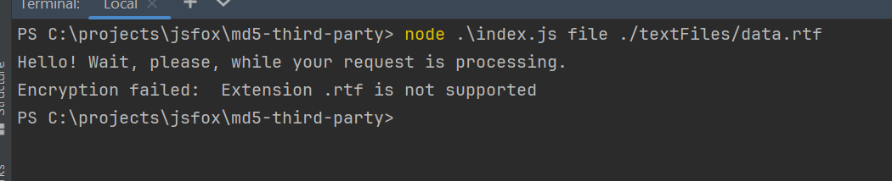
5. file not found: 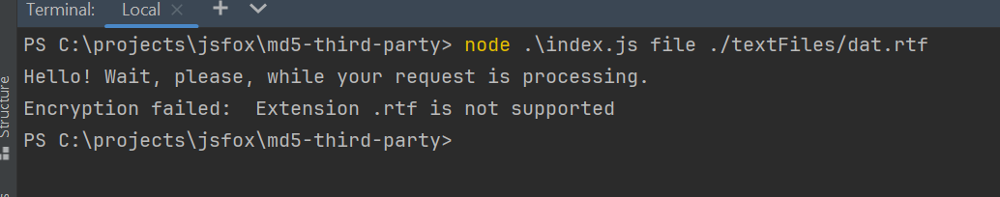
6. using npm exec: 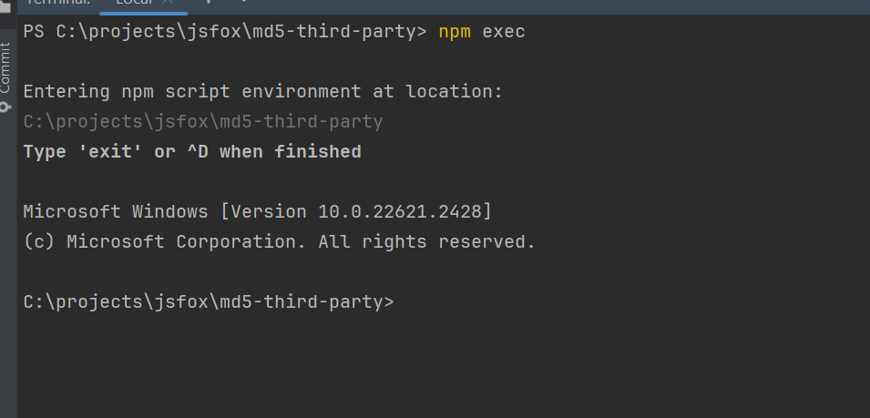
7. using npm exec message mode: 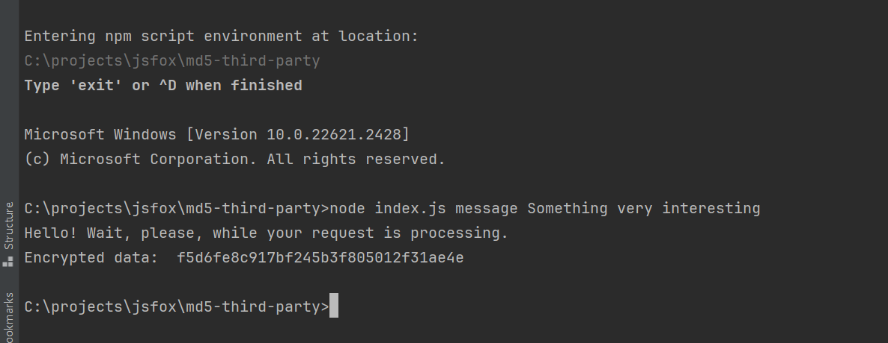
8. using npm exec file mode: 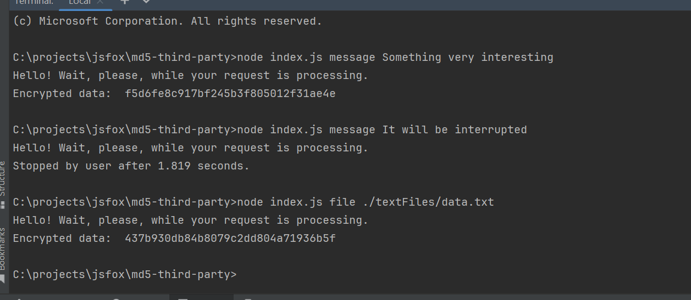
9. using npm exec interruption script: 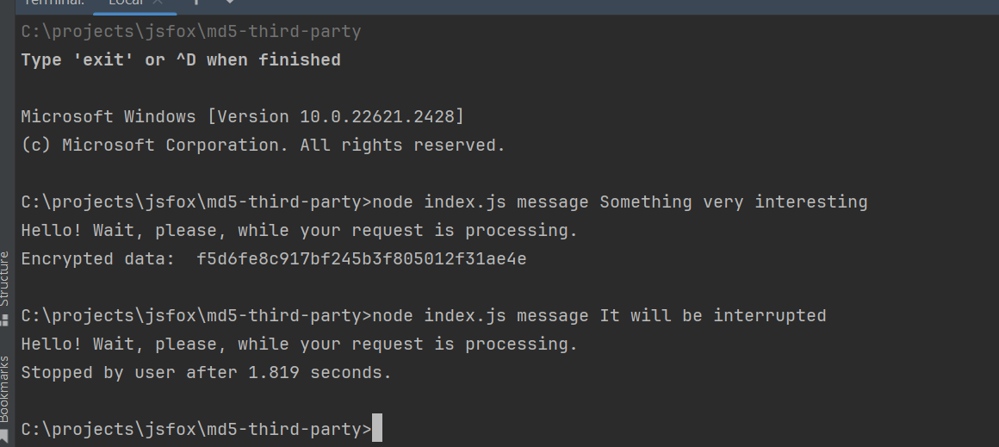
10. using npm exec file not found exception: 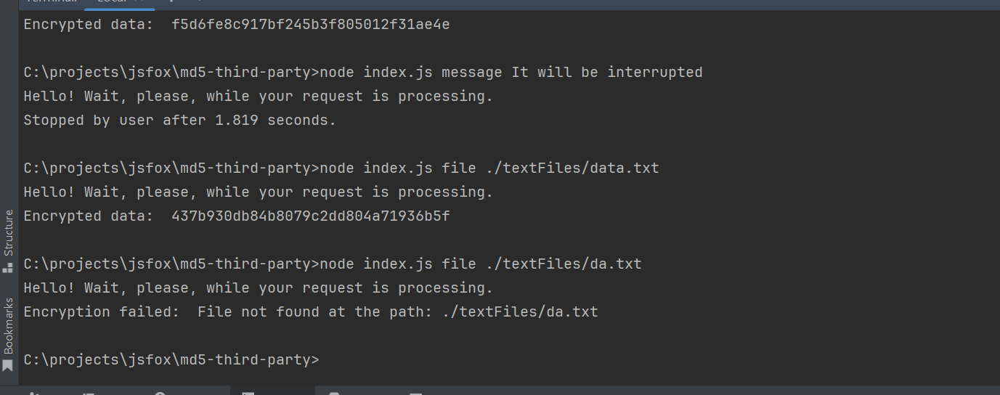
11. using npm exec file with wrong extension: 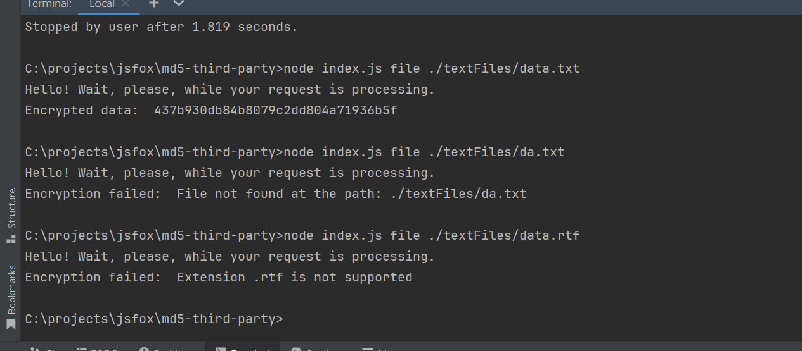
12. using npm exec wrong mode: 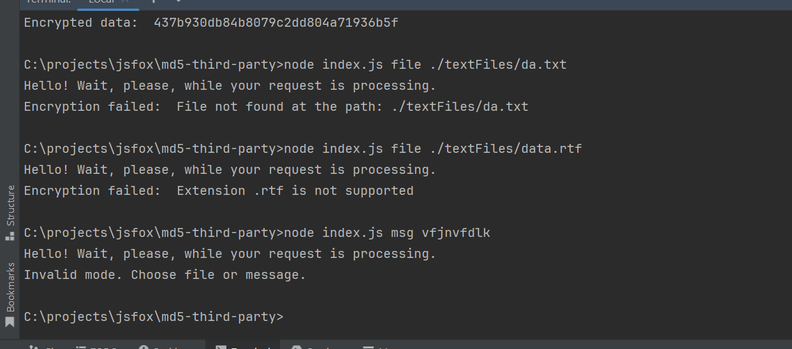
13. using npm exec file with wrong command provided: 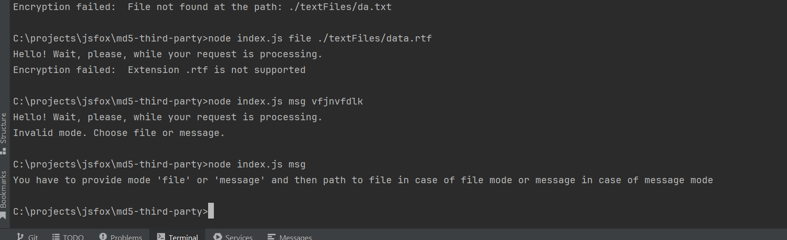